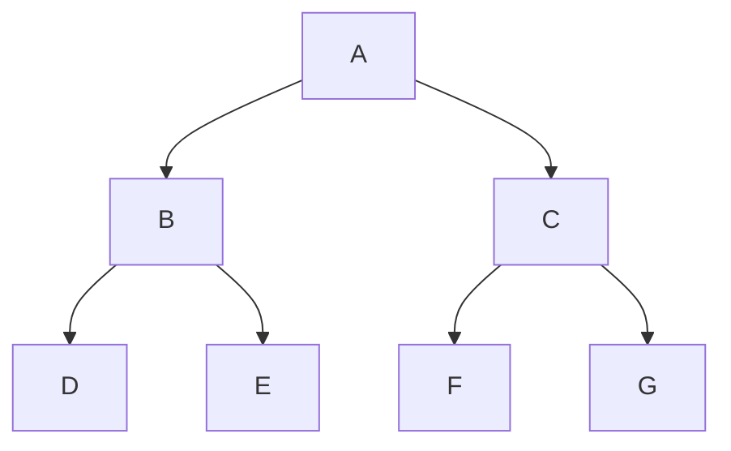
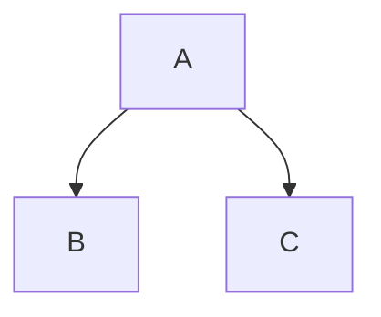
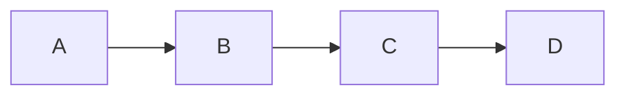
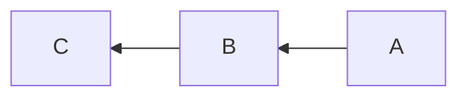
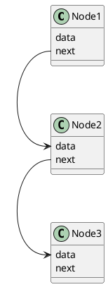
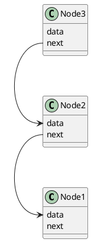

###### Build a Binary tree

Llama Index : Is a Tree Index

    - Binary Tree Based algorithm

    - Search the data, we need to know how the data is searched?

Tree Traversals:

1) Depth First Traversal
   
     - Uses Stack for storing the nodes when traversing
   
   1) In order : 
   
   2) Pre order
   
   3) Post order
- Breadth First Traversal

        - Uses queue for storing the nodes when traversing

Based on above graph the DF traversals are as below:

> Pre order: A -> B -> C
> 
> Post order: B ->C -> A
> 
> In order: B -> A -> C

Breadth First:

> L1 = A
> 
> L2 = B , C

###### Why are we Stack for DFS?

- Stack is LiFo : Node that entered last will pop First
  
  - How the list appends the elements? It appends from the right and it pops from right

###### Can we append and pop from left of the Python List?

1. insert(0, idx)

2. pop(idx)

3. 

###### Why are we Queue for BFS ?

- Queue is FiFo: Node that entered very first, will be poped first

